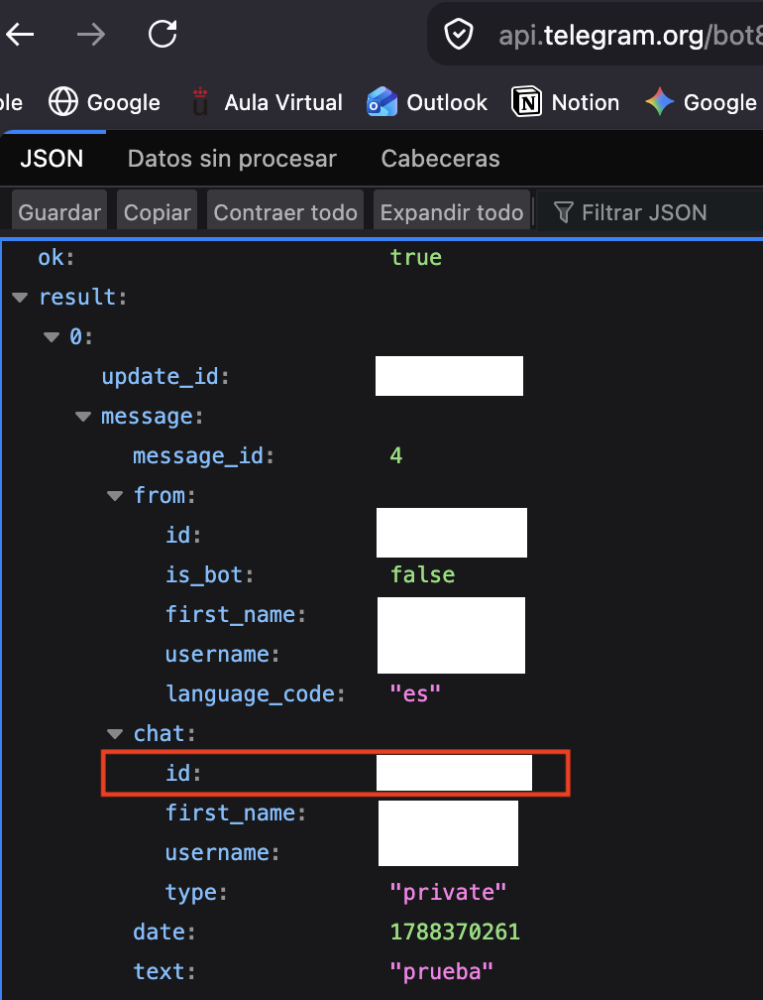

# Mini_Soc
*Publication date: 02/09/2026*

> [!NOTE]
> **Iker Marín López (IML15)**
>
> Cybersecurity Engineer (Universidad Rey Juan Carlos)
>
> **Links:** 🔗 [LinkedIn](https://www.linkedin.com/in/iker-marin-lopez-90791b379/) | 
> 🐱[GitHub](https://github.com/IML15) | 📥 [Telegram](https://t.me/hueco44)

This repository demonstrates a lightweight Security Operations Center (Mini-SOC) automation engine written
in Python. It is designed for cybersecurity practitioners and students interested in learning real-time
log ingestion, pattern-based intrusion detection, and immediate security incident alerting via Telegram bots.

> [!WARNING]
> This document and tool have been created for educational purposes in a controlled environment. 
> The author is not responsible for any misuse of the information presented herein.

---

## 🛡️ Mini-SOC Architecture & Detection Engine

The Mini-SOC monitors authentication and access logs (such as `auth.log` or syslog) in real-time,
scanning incoming entries against configurable regular expression (regex) signatures. When suspicious
behaviors—such as brute-force password guessing, invalid SSH user attempts, or credential-stuffing
patterns—are detected, an automated incident payload is assembled and dispatched to a dedicated Telegram
channel or chat.

- **Note**: This setup simulates SIEM/EDR log collection mechanisms using a clean, dependency-controlled
- Python virtual environment (`.venv`) to guarantee reproducible deployments across testing nodes.

---

## 🚀 Features

- **Real-Time Log Tail & Ingestion**: Continuously tails local authentication logs without reloading
files from scratch.
- **Pattern-Based Threat Detection**: Evaluates events using compiled regex rules
(`failed password`, `invalid user`, `authentication failure`).
- **Encrypted Alerting Channel**: Dispatches instant telemetry alerts over HTTPS
via the official Telegram Bot API using `requests`.
- **Environment Isolation & Security**: Employs `python-dotenv` to safeguard
bot tokens, chat IDs, and operational file paths outside the version control system.

---

## 👾 Setup & Installation

### 1. Repository & Virtual Environment Setup

Always create an isolated virtual environment to prevent dependency conflicts with other projects:

```bash
# Clone the repository and navigate into the root folder
cd Mini_Soc

# Create an isolated virtual environment
python3 -m venv .venv

# Activate the virtual environment
# On macOS / Linux:
source .venv/bin/activate
# On Windows (PowerShell):
.venv\Scripts\Activate.ps1
```

### 2. Install Dependencies

Install the required packages using the project's dependency definition:

```bash
pip install -r requirements.txt
```

### 3. Configure Environment Variables

Create a `.env` file in the root directory (PRIVATE user data):

```env
TELEGRAM_BOT_TOKEN="your_bot_token_here"
TELEGRAM_CHAT_ID="your_telegram_chat_id_here"
LOG_FILE_PATH="auth.log"
```

You can create your own bot using @BotFather, for example. Once you have created the bot and 
have its token, send it a `/start` message to initialize it, and then send it a trivial test message.
Now go to `https://api.telegram.org/bot<Your token>/getUpdates` and there you will get your ID.

<br>

<p align="center">
  
</p>

<br>

### 4. Project Structure

Ensure your directory matches the following structure:

```text
Mini_Soc/
├── .venv/
├── src/
│   └── mini_soc.py
├── .env
├── .gitignore
├── requirements.txt
└── README.md
```

---

## 💻 Usage & Execution Steps

### Step 1: Create a Test Log File (Controlled Testing)

In a separate terminal or within the root directory, create an empty `auth.log`
file to simulate system log streaming (`auth.log` file must be in the same directory as the script):

```bash
touch auth.log
```

### Step 2: Run the Mini-SOC Engine

With your `.venv` activated, launch the monitoring script:

```bash
python mini_soc.py
```

The script will validate your environment variables, initialize regex rule definitions,
and begin watching the target log file.

### Step 3: Simulate an Intrusion / Authentication Attack

Open another terminal window and append suspicious log lines to trigger the detection signatures:

```bash
# Simulate a brute-force SSH failure
echo "$(date '+%b %d %H:%M:%S') workstation sshd[1337]: Failed password for invalid user
admin from 192.168.1.105 port 44321 ssh2" >> auth.log

# Simulate an authentication failure event
echo "$(date '+%b %d %H:%M:%S') workstation login[2048]: authentication failure; logname=
uid=0 euid=0 tty=NODEV" >> auth.log
```

---

## 🔐 Detection & Alert Verification

When a malicious pattern is matched, the engine triggers an HTTP POST request to Telegram.
The verification workflow includes:

- **Signature Matching**: The regex rule successfully flags patterns like `failed password` and
`invalid user`.
- **Alert Dispatch**: The incident details (timestamp, source IP, affected user, raw payload) are
transmitted over TLS directly to your Telegram chat.
- **Console Feedback**: Real-time feedback is printed to the terminal confirming the alert
dispatch status (HTTP 200).

<br>

### Verification (Telegram Incident Alert)

Upon triggering the attack simulation, an automated notification arrives instantly:


<br>

---

## 🛠 Technical Stack

- **Python 3.x**: Main engine logic and process lifecycle.
- `re` Module: High-performance precompiled regular expression matching.
- `requests`: HTTP client handling structured JSON payloads to the Telegram Bot API.
- `python-dotenv`: Management and loading of operational environment variables.
- `os` & `datetime`: File I/O streaming, buffer pointers, and UTC/local timestamping.
